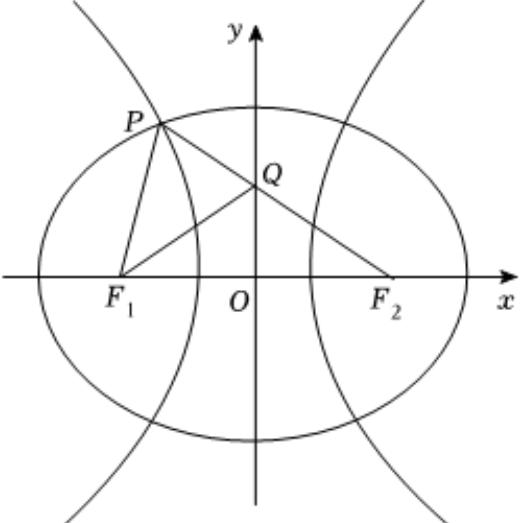

> [!faq]- 2025-2026学年内蒙古包头市高二（上）期末数学试卷解析
>
> > [!success]- **【答案】** $\frac{8}{3}$
>
> > [!note]- **【解析】**
> > 如图，由椭圆的定义可知 $\left|PF_{1}\right|+\left|PF_{2}\right|=6,\left|F_{1}F_{2}\right|=4$
> >
> > 
> >
> > 由双曲线的定义可知 $\left|PF_{2}\right|-\left|PF_{1}\right|=2a$ ，所以 $\left|PF_{1}\right|=3-a,\left|PF_{2}\right|=3+a$ ，设 $\angle PF_{1}F_{2}=2\theta$ ，因为 $PF_{2}$ 交y轴于点Q，
> >
> > 且 $QF_{1}$ 平分 $\angle PF_{1}F_{2}$ ，所以 $\angle QF_{2}F_{1}=\angle QF_{1}F_{2}=\theta$
> >
> > 在 $\triangle PF_{1}F_{2}$ 中，由余弦定理可得：
> >
> > $\cos \theta = \frac{|PF_2|^2 + |F_1F_2|^2 - |PF_1|^2}{2|PF_2|\cdot|F_1F_2|} = \frac{(3 + a)^2 + 16 - (3 - a)^2}{8(a + 3)} = \frac{3a + 4}{2a + 6}$
> >
> > 设 $|QF_{1}|=|QF_{2}|=m$ ，则 $|PQ|=|PF_{2}|-|QF_{2}|=a+3-m$ ，
> >
> > 由角平分线定理可知， $\frac{|PF_1|}{|F_1F_2|} = \frac{|PQ|}{|QF_2|}$
> >
> > 即 $\frac{3 - a}{4} = \frac{a + 3 - m}{m}$ ，解得 $m = \frac{12 + 4a}{7 - a}$
> >
> > 在 $Rt\triangle QOF_2$ 中， $\cos \angle QF_2F_1 = \cos \theta = \frac{|OF_2|}{|QF_2|} = \frac{2}{m} = \frac{7 - a}{6 + 2a} = \frac{3a + 4}{2a + 6}$
> >
> > 解得 $a = \frac{3}{4}$ ，因此双曲线的离心率为 $\frac{2}{a} = \frac{8}{3}$
> >
> > 故答案为： $\frac{8}{3}$ .
