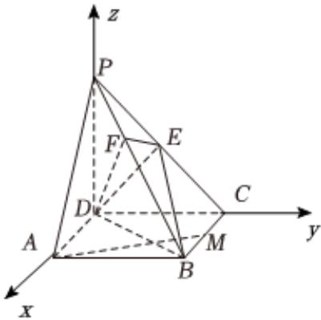

> [!faq]- 2025-2026学年内蒙古包头市高二（上）期末数学试卷解析
>
> > [!success]- **【答案】** 详见解析
>
> > [!note]- **【解析】**
> > 详见解析
> >
> > 以 $D$ 为原点， $DA$ ， $DC$ ， $DP$ 所在直线分别为 $\pmb{x}$ 轴、 $\pmb{y}$ 轴、 $\pmb{z}$ 轴，建立如图所示的空间直角坐标系，
> >
> > 
> >
> > (1)证明：依题意得 $B(\sqrt{2}, 1, 0)$ ， $P(0, 0, 1)$ ， $C(0, 1, 0)$ ， $E(0, \frac{1}{2}, \frac{1}{2})$ ，
> >
> > $$
> > \overrightarrow {P B} = \left(\sqrt {2}, 1, - 1\right), \overrightarrow {D E} = \left(0, \frac {1}{2}, \frac {1}{2}\right)
> > $$
> >
> > 故 $\overrightarrow{PB} \cdot \overrightarrow{DE} = 0 + \frac{1}{2} - \frac{1}{2} = 0$
> >
> > 所以 $PB \perp DE$ ，
> >
> > 由已知 $EF\perp PB$ ，且 $EF\cap DE=E$ ，
> >
> > 所以 $PB \perp$ 平面EFD；
> >
> > (2)证明：由 $A(\sqrt{2}, 0, 0), M(\frac{\sqrt{2}}{2}, 1, 0)$ ，故 $\overrightarrow{AM} = (-\frac{\sqrt{2}}{2}, 1, 0)$ ，
> >
> > 由(1)知 $\overrightarrow{PB}$ 是平面 $EFD$ 的一个法向量，
> >
> > 由 $\overrightarrow{AM} \cdot \overrightarrow{PB} = \sqrt{2} \times \left(-\frac{\sqrt{2}}{2}\right) + 1 + 0 = 0$ ，则 $AM \perp PB$
> >
> > 显然 $AM \notin$ 平面EFD，
> >
> > 所以AM//平面EFD；
> >
> > (3)设平面DEB的法向量为 $\overrightarrow{n}=\left(x,y,z\right)$ ,
> >
> > 则 $\left\{ \begin{array}{l} \overrightarrow{n} \cdot \overrightarrow{DE} = \frac{1}{2} y + \frac{1}{2} z = 0 \\ \overrightarrow{n} \cdot \overrightarrow{DB} = \sqrt{2} x + y = 0 \end{array} \right.$ ，可取 $\overrightarrow{n} = (1, -\sqrt{2}, \sqrt{2})$ ，
> >
> > 平面 $EFD$ 的一个法向量为 $\overrightarrow{PB} = (\sqrt{2}, 1, -1)$ ,
> >
> > $$
> > | c o s <   \overrightarrow {P B}, \overrightarrow {n} > = \frac {\overrightarrow {P B} \cdot \overrightarrow {n}}{| \overrightarrow {P B} | \cdot | \overrightarrow {n} |} = \frac {\sqrt {2} - \sqrt {2} - \sqrt {2}}{\sqrt {5} \times 2} = - \frac {\sqrt {1 0}}{1 0},
> > $$
> >
> > 设平面 $EFD$ 与平面 $EBD$ 的夹角为 $\theta$ ，则 $sin\theta = \frac{3\sqrt{10}}{10}$
> >
> > 所以平面 $EFD$ 与平面 $EBD$ 的夹角的正弦值为 $\frac{3\sqrt{10}}{10}$ .
