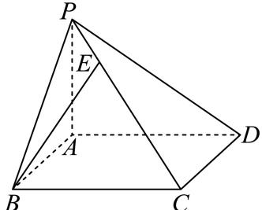

<!-- question-source:start -->
3、

我国古代数学名著《九章算术》中，将底面为矩形且一侧棱垂直于底面的四棱锥称为阳马。如图所示，已知四棱锥 $P - ABCD$ 是阳马， $PA \perp$ 平面 $ABCD$ ，且 $PE = \frac{1}{4} PC$ ，若 $\overrightarrow{AB} = \overrightarrow{a}, \overrightarrow{AD} = \overrightarrow{b}, \overrightarrow{AP} = \overrightarrow{c}$ ，则 $\overrightarrow{BE} = (\quad)$

$$
- \frac {5}{4} \overrightarrow {a} - \frac {1}{4} \overrightarrow {b} + \frac {5}{4} \overrightarrow {c}
$$

$$
\frac {5}{4} \overrightarrow {a} + \frac {1}{4} \overrightarrow {b} - \frac {5}{4} \overrightarrow {c}
$$

$$
\frac {3}{4} \overrightarrow {a} - \frac {1}{4} \overrightarrow {b} - \frac {3}{4} \overrightarrow {c}
$$

$$
- \frac {3}{4} \overrightarrow {a} + \frac {1}{4} \overrightarrow {b} + \frac {3}{4} \overrightarrow {c}
$$
<!-- question-source:end -->

![[Q00092053A1]]
