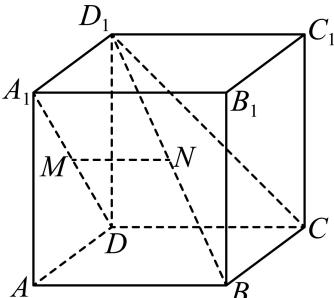

<!-- question-source:start -->
4、

如图，在棱长为1正方体 $ABCD - A_{1}B_{1}C_{1}D_{1}$ 中， $M, N$ 分别是 $A_{1}D, BD_{1}$ 的中点，则（）

A 四点 $A, M, N, C$ 共面

B 直线 $MN$ 与面 $D_{1}CB$ 所成角为 $\frac{\pi}{4}$

C 异面直线 $CN$ 与 $D_{1}C_{1}$ 所成角的余弦值为 $\frac{\sqrt{3}}{3}$

D 过 $M, B, C$ 三点的平面截正方体所得图形面积为 $2\sqrt{5}$
<!-- question-source:end -->

![[Q00092062A1]]
