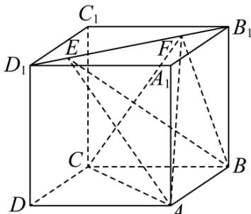

<!-- question-source:start -->
8. 如图，正方体 $ABCD - A_{1}B_{1}C_{1}D_{1}$ 的棱长为1，线段 $B_{1}D_{1}$ 上有两个动点 $\pmb{E},\pmb{F}$ ，且 $EF = \frac{\sqrt{2}}{2}$ . 则下列结论中正确的有 \_\_\_\_.

①当 $E$ 向 $D_{1}$ 运动时，二面角 $A - EF - B$ 的大小不变

②二面角 $E-AB-C$ 的最小值为 $45^{\circ}$

③当 $E$ 向 $D_{1}$ 运动时， $AE \perp CF$ 总成立

④ $\overrightarrow{EF}$ 在 $\overrightarrow{CB}$ 方向上的投影向量为 $\frac{1}{2}\overrightarrow{CB}$
<!-- question-source:end -->

![[Q00092603A1]]
