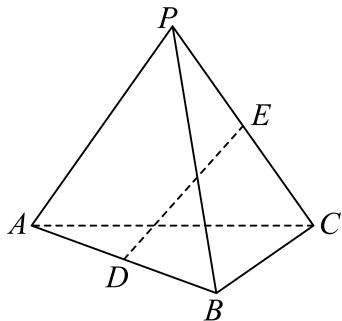

<!-- question-source:start -->
3、如图，在正三棱锥 $P - ABC$ 中， $AB = 2\sqrt{3}$ ， $PA = 3$ ， $D$ 是棱 $AB$ 的中点，点 $E$ 在棱 $PC$ 上， $\overrightarrow{PE} = k\overrightarrow{PC}$ . 记 $\overrightarrow{PA} = \overrightarrow{a}, \overrightarrow{PB} = \overrightarrow{b}, \overrightarrow{PC} = \overrightarrow{c}$ .

(1)用 $\overrightarrow{a},\overrightarrow{b},\overrightarrow{c}$ 表示 $\overrightarrow{DE}$ ;

(2)若 $DE\cdot PC=0$ ，求k的值；

(3)求 $|\overrightarrow{DE}|$ 的最小值.
<!-- question-source:end -->

![[Q00092604A1]]
