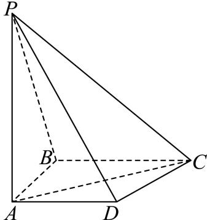

<!-- question-source:start -->
5、如图，四棱锥P-ABCD中，PA⊥底面ABCD，AB⊥BC，AD//平面PBC，PA=AC=2.

(1)证明： $AD\bot PB$

(2)已知点 $B$ 到平面 $PAC$ 的距离为1，求二面角 $A - CP - B$ 的余弦值.
<!-- question-source:end -->

![[Q00092606A1]]
