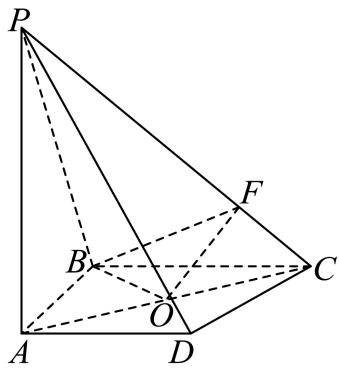

> [!faq]- 2025-2026学年内蒙古自治区包头市第九中学外国语学校高二上学期11月期中学科评估数学试题解析
>
> > [!success]- **【答案】** 详见解析
>
> > [!note]- **【解析】**
> > 详见解析
> >
> > （1）在四棱锥P-ABCD中， $PA \perp$ 平面ABCD，AD⊂平面ABCD，则 $PA \perp AD$ ，由AD∥平面PBC，平面 $PBC \cap$ 平面ABCD=BC，得AD∥BC，而 $AB \perp BC$ ，则 $AB \perp AD$ ，而 $PA \cap AB = A, PA, AB \subset$ 平面PBC，因此AD⊥平面PBC，又PB⊂平面PBC，所以AD⊥PB.
> > （2）过点B在平面ABCD内作BO⊥AC于O，由PA⊥平面ABCD，得PA⊥BO，
> > 而 $PA \cap AC = A, PA, AC \subset$ 平面PAC，则 $BO \perp$ 平面PAC，BO = 1，
> > 又PC⊂平面PAC，则BO⊥PC，
> > 在Rt△ABC中，AC = 2，则 $\left\{\begin{aligned}AB^{2}+BC^{2}&=4\\ AB\cdot BC&=BO\cdot AC=2\end{aligned}\right.$ ，解得 $AB=BC=\sqrt{2}$ ，
> > O为AC中点，即CO=1，在平面PAC内过O作OE⊥PC于E，连接BE， $BO \cap OE = O, BO, OE \subset$ 平面BOE，则 $PC \perp$ 平面BOE，又BE⊂平面BOE，
> > 于是 $BE \perp PC$ ，∠OEB是二面角A-CP-B的平面角，
> > 由 $PA \perp AC, AP = AC = 2$ ，得 $\angle PCA = 45^{\circ}, OE = \frac{\sqrt{2}}{2}$ ，而 $BO \perp OE$ ，
> > 则 $BE = \sqrt{1^{2} + (\frac{\sqrt{2}}{2})^{2}} = \frac{\sqrt{6}}{2}, \cos\angle OEB = \frac{OE}{BE} = \frac{\sqrt{3}}{3},$ 所以二面角A-CP-B的余弦值为 $\frac{\sqrt{3}}{3}$ .
> >
> > 
