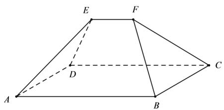

<!-- question-source:start -->
4、

《九章算术》是古代中国乃至东方的第一部自成体系的数学专著，书中记载了一种名为“刍甍”的五面体（如图），其中四边形ABCD为矩形， $EF \parallel AB$ ，若AB = 3EF，△ADE和△BCF都是正三角形，且AD = 2EF，则异面直线DE与BF所成角的大小为()

A $\frac{\pi}{2}$ B $\frac{\pi}{4}$ C $\frac{\pi}{3}$ D $\frac{\pi}{6}$
<!-- question-source:end -->

![[Q00092078A1]]
