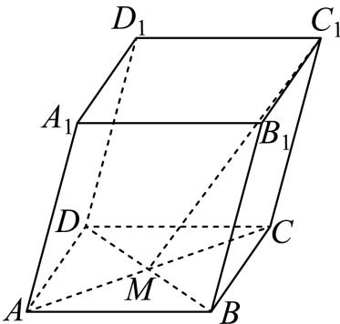

<!-- question-source:start -->
5、

如图，在平行六面体 $ABCD - A_1B_1C_1D_1$ 中， $AC$ 与 $BD$ 的交点为点 $M$ ，设 $\overrightarrow{AB} = \overrightarrow{a}$ ， $\overrightarrow{AD} = \overrightarrow{b}$ ， $\overrightarrow{AA_1} = \overrightarrow{c}$ ，则下列向量中与 $\overrightarrow{C_1M}$ 相等的向量是（）

A $-\frac{1}{2}\overrightarrow{a} -\frac{1}{2}\overrightarrow{b} +\overrightarrow{c}$ B $-\frac{1}{2}\overrightarrow{a} -\frac{1}{2}\overrightarrow{b} -\overrightarrow{c}$ C $\frac{1}{2}\overrightarrow{a} +\frac{1}{2}\overrightarrow{b} +\overrightarrow{c}$ D $\frac{1}{2}\overrightarrow{a} -\frac{1}{2}\overrightarrow{b} +\overrightarrow{c}$
<!-- question-source:end -->

![[Q00092079A1]]
