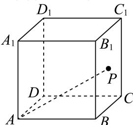

<!-- question-source:start -->
4、

如图，点 $P$ 是棱长为2的正方体 $ABCD - A_{1}B_{1}C_{1}D_{1}$ 的表面上一个动点，则以下说法正确的是（）

$$
B C C _ {1} B _ {1}
$$

$$
P - A A _ {1} D _ {1}
$$

B 当 $P$ 在线段 $AC$ 上运动时， $D_{1}P$ 与 $A_{1}C_{1}$ 所成角的取值范围是 $\left[\frac{\pi}{3}, \frac{\pi}{2}\right]$

C 若点 $P$ 在底面 $ABCD$ 上运动，则使直线 $A_{1}P$ 与平面 $ABCD$ 所成的角为 $45^{\circ}$ 的点 $P$ 的轨迹为椭圆  
D 若 $F$ 是 $A_{1}B_{1}$ 的中点，点 $P$ 在底面 $ABCD$ 上运动时，不存在点 $P$ 满足 $PF \parallel$ 平面 $B_{1}CD_{1}$
<!-- question-source:end -->

![[Q00092629A1]]
