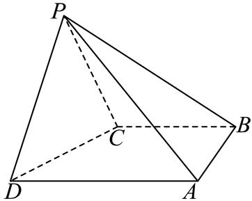

<!-- question-source:start -->
2、

如图，在四棱锥P-ABCD中，PD=PC=CB=BA= $\frac{1}{2}$ AD=2，AD//CB， $\angle CPD=\angle ABC=90^{\circ}$ ，平面 $PCD\perp$ 平面ABCD.

1 求证： $PD \perp$ 平面PCA；

2 点Q在棱PA上， $\overrightarrow{PQ}=\frac{1}{2}\overrightarrow{PA}$ ，求平面PCD与平面CDQ夹角的余弦值.
<!-- question-source:end -->

![[Q00092634A1]]
