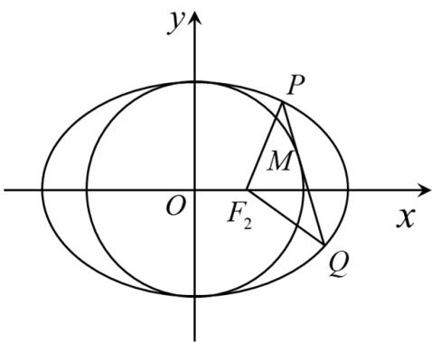

<!-- question-source:start -->
4、

已知椭圆 $\frac{x^2}{a^2} +\frac{y^2}{b^2} = 1(a > b > 0)$ 的右焦点为 $F_{2}(1,0)$ ，点 $H(1,\frac{3}{2})$ 在椭圆上.

1 求椭圆方程；

点 $M(x_0,y_0)$ 在圆 $x^{2} + y^{2} = b^{2}$ 上， $M$ 在第一象限，过 $M$ 作圆 $x^{2} + y^{2} = b^{2}$ 的切线交椭圆于 $P,Q$ 两点，问 $|F_{2}P| + |F_{2}Q| + |PQ|$ 是否为定值？如果是，求出定值，如不是，说明理由。
<!-- question-source:end -->

![[Q00092636A1]]
