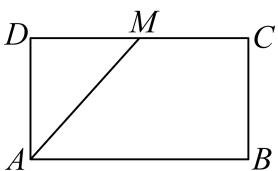
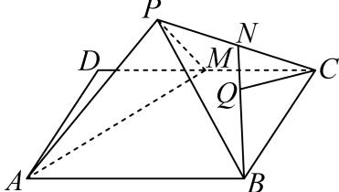

<!-- question-source:start -->
6、

如图①所示，长方形ABCD中，AD=1，AB=2，点M是边CD的中点，将△ADM沿AM翻折到△PAM，连接PB，PC，得到图②的四棱锥P-ABCM.

  
图①

  
图②

1 求四棱锥 $P - ABCM$ 的体积的最大值；

2 若棱 $PC$ 的中点为 $N$ ， $Q$ 为 $BN$ 上的点，当 $CQ //$ 平面 $PAM$ 时，求 $\frac{BQ}{BN}$ 的值；

3 设 $P - AM - D$ 的大小为 $\theta$ ，若 $\theta \in \left(0, \frac{\pi}{2}\right]$ ，求平面 $PAM$ 和平面 $PBC$ 夹角余弦值的最小值。
<!-- question-source:end -->

![[Q00092638A1]]
