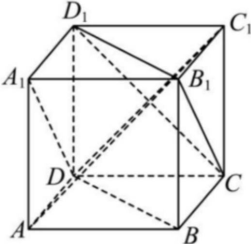

<!-- question-source:start -->
3、如图， $ABCD - A_{1}B_{1}C_{1}D_{1}$ 为正方体，边长为1，下列说法正确的是（）

A $AC_{1}\perp$ 平面 $CB_{1}D_{1}$ B $A$ 到面 $CB_{1}D_{1}$ 的距离为 $\frac{2\sqrt{3}}{3}$ C 异面直线 $BD$ 与 $CD_{1}$ 的距离为 $\frac{\sqrt{3}}{3}$ D 异面直线 $BD$ 与 $CB_{1}$ 的夹角为 $\frac{\pi}{6}$
<!-- question-source:end -->

![[Q00092618A1]]
