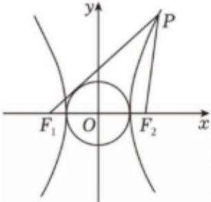

<!-- question-source:start -->
3、如图，双曲线 $\frac{x^{2}}{a^{2}}-\frac{y^{2}}{b^{2}}=1(a>0,b>0)$ 的左、右焦点分别为 $F_{1},F_{2},P$ 是双曲线右支上一点，满足 $\left|PF_{2}\right|=\left|F_{1}F_{2}\right|$ ，直线 $PF_{1}$ 与圆 $x^{2}+y^{2}=a^{2}$ 相切，则双曲线的离心率为\_\_\_\_.

<!-- question-source:end -->

![[Q00092621A1]]
