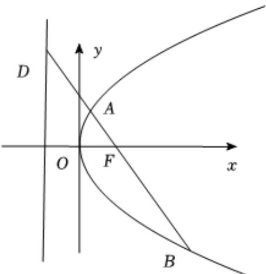

> [!faq]- 2025-2026年内蒙古包头市高二上学期数学期末考试模拟试卷解析
>
> > [!success]- **【答案】** ABC
>
> > [!note]- **【解析】**
> > 抛物线 $C:y^{2} = 2px(p > 0)$ 的焦点为 $F$ ，经过点 $F$ 且倾斜角为 $\frac{2\pi}{3}$ 的直线 $l$ 与抛物线 $C$ 交于 $A$ ， $B$ 两点（点 $B$ 在第四象限），设 $A(x_{A},y_{A})$ ， $B(x_{B},y_{B})$ .由题意知 $F\left(\frac{p}{2},0\right)$ ，直线 $l$ 的斜率 $k = -\sqrt{3}$
> >
> > 
> >
> > 则直线l的方程为 $y=-\sqrt{3}(x-\frac{p}{2})$ ，将其代入抛物线C，得 $12x^{2}-20px+3p^{2}=0$ 得 $x_{B}=\frac{3}{2}p$ ， $x_{A}=\frac{1}{6}p$ ，由 $|BF|=\frac{3}{2}p+\frac{p}{2}=2p=2$ ，得p=1，选项A正确；
> > 抛物线C的方程为 $y^{2}=2x$ ， $x_{A}=\frac{1}{6}p=\frac{1}{6}$ ，∴ $|AF|=\frac{1}{6}p+\frac{p}{2}=\frac{2}{3}$ ∴ $|BF|=2=3|AF|$ ，选项C正确；
> > 将直线l的方程为 $y=-\sqrt{3}(x-\frac{1}{2})$ 与准线 $x=-\frac{1}{2}$ 联立，得 $D(-\frac{1}{2},\sqrt{3})$ ∴ $|FD|=\sqrt{\left(\frac{1}{2}+\frac{1}{2}\right)^{2}+(\sqrt{3})^{2}}=2=|BF|$ ，选项B正确； $\frac{1}{|AF|}+\frac{1}{|BF|}=\frac{3}{2}+\frac{1}{2}=2$ ，选项D错误.
> > 故选：ABC
