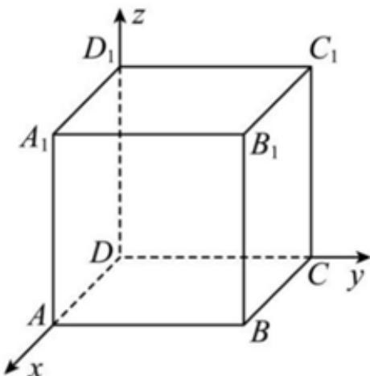

> [!faq]- 2025-2026年内蒙古包头市高二上学期数学期末考试模拟试卷解析
>
> > [!success]- **【答案】** ABC
>
> > [!note]- **【解析】**
> > 
> >
> > 选项A：
> >
> > 如图建立空间直角坐标系，由题意， $D(0,0,0)$ ， $A(1,0,0)$ ， $C_1(0,1,1)$ ， $C(0,1,0)$ ， $B_{1}(1,1,1)$ ， $D_{1}(0,0,1),\overrightarrow{AC_{1}} = (-1,1,1)$ ， $\overrightarrow{B_1C} = (-1,0, - 1)$ ， $\overrightarrow{B_1D_1} = (-1, - 1,0)$ ， $\overrightarrow{AC_1}\cdot \overrightarrow{B_1C} = 0$ ， $\overrightarrow{AC_1}\cdot \overrightarrow{B_1D_1} = 0$ ，所以 $B_{1}D_{1}\bot AC_{1}$ ， $B_{1}C\bot AC_{1}$ 。
> >
> > 又因 $B_{1}D_{1}\subset$ 平面 $CB_{1}D_{1}$ ， $B_{1}C\subset$ 平面 $CB_{1}D_{1}$ ， $B_{1}D_{1}\cap B_{1}C=B_{1}$ ，所以 $AC_{1}\perp$ 平面 $CB_{1}D_{1}$ ，A正确，
> >
> > B选项：
> >
> > 由 $A$ 知 $\overrightarrow{AC_1} = (-1, 1, 1)$ 为平面 $CB_1D_1$ 的法向量， $\overrightarrow{AB_1} = (0, 1, 1)$ ，
> >
> > 所以 $A$ 到面 $CB_{1}D_{1}$ 的距离为 $\frac{\left|\overrightarrow{AC_1}\cdot\overrightarrow{AB_1}\right|}{\left|\overrightarrow{AC_1}\right|} = \frac{2}{\sqrt{3}} = \frac{2\sqrt{3}}{3}$ ，故B正确，
> >
> > C选项：
> >
> > $$
> > B (1, 1, 0), \overrightarrow {D B} = (1, 1, 0), \overrightarrow {C D _ {1}} = (0, - 1, 1)
> > $$
> >
> > 设异面直线BD与 $CD_{1}$ 的公共法向量为 $\vec{n}=(x,y,z)$
> >
> > 则 $\overrightarrow{DB} \cdot \vec{n} = x + y = 0$ ， $\vec{n} \cdot \overrightarrow{CD_1} = -y + z = 0$ ，令 $x = 1$ ，则 $y = -1$ ， $z = -1$
> >
> > $$
> > \vec {n} = (1, - 1, - 1), \overline {{B C}} = (- 1, 0, 0)
> > $$
> >
> > 则异面直线BD与 $CD_{1}$ 的距离为 $\frac{\left|\overrightarrow{BC}\cdot\overrightarrow{n}\right|}{\left|\overrightarrow{n}\right|}=\frac{1}{\sqrt{3}}=\frac{\sqrt{3}}{3}$ ，故C正确，
> >
> > D选项：
> >
> > $$
> > \overrightarrow {D B} = (1, 1, 0), \overrightarrow {B _ {1} C} = (- 1, 0, - 1)
> > $$
> >
> > $$
> > \cos <   \overrightarrow {D B}, \overrightarrow {B _ {1} C} > = \frac {\overrightarrow {D B} \cdot \overrightarrow {B _ {1} C}}{\left| \overrightarrow {D B} \right| \cdot \left| \overrightarrow {B _ {1} C} \right|} = \frac {- 1}{\sqrt {2} \cdot \sqrt {2}} = - \frac {1}{2},
> > $$
> >
> > 所以异面直线BD与 $CB_{1}$ 的夹角的余弦值为 $\frac{1}{2}$ ，夹角为 $\frac{\pi}{3}$ ，故D错误，
> >
> > 故选：ABC
