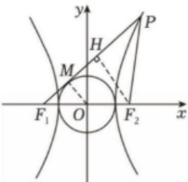

> [!faq]- 2025-2026年内蒙古包头市高二上学期数学期末考试模拟试卷解析
>
> > [!success]- **【答案】** $\frac{5}{3}$
>
> > [!note]- **【解析】**
> > 已知双曲线 $\frac{x^2}{a^2} -\frac{y^2}{b^2} = 1(a > 0,b > 0)$ 的左、右焦点分别为 $F_{1}$ ， $F_{2}$ 又 $P$ 是双曲线右支上一点，满足 $\left|PF_2\right| = \left|F_1F_2\right|$ ，直线 $PF_{1}$ 与圆 $x^{2} + y^{2} = a^{2}$ 相切，设直线 $PF_{1}$ 与圆 $x^{2} + y^{2} = a^{2}$ 相切于点 $M$ ，则 $\left|OM\right| = a$ ，又 $\left|OF_1\right| = c$ 所以 $\left|F_1M\right| = b$ ，过 $F_{2}$ 作 $F_{2}H\bot PF_{1}$ 于点 $H$ 因为 $\left|F_2P\right| = \left|F_1F_2\right|$ ，所以 $H$ 为 $PF_{1}$ 中点，且 $HF_{2} / / OM$ 所以 $\frac{\left|MF_1\right|}{\left|HF_1\right|} = \frac{\left|OF_1\right|}{\left|F_1F_2\right|} = \frac{1}{2}$ ，所以 $\left|HF_1\right| = 2b$ 所以 $\left|F_{1}P\right| = 4b$ ，又 $\left|F_{2}P\right| = \left|F_{1}F_{2}\right| = 2c$ 。 $|F_1P| - |F_2P| = 2a$ ，即 $4b - 2c = 2a$ ，即 $2b = c + a$ 从而 $\left\{ \begin{array}{l} 2b = c + a \\ c^2 -a^2 = b^2 \end{array} \right.$ 即 $4(c^2 -a^2) = (c + a)^2$ 即 $4(c - a) = c + a$ ，解得 $e = \frac{5}{3}$
> >
> > 
> >
> > 故答案为： $\frac{5}{3}$ 。
