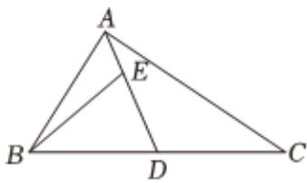

<!-- question-source:start -->
6、已知 $\ln a > \ln b > 0, c > 0$ ，则（）
A $2^{a} < 2^{b}$ B $\frac{b + c}{a + c} < \frac{b}{a}$ C $\frac{a + b}{2} < \sqrt{ab}$ D $ab + 1 > a + b$

<!-- question-source:end -->

![[Q00091215A1]]
