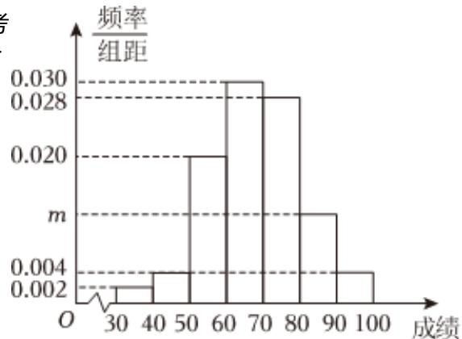

<!-- question-source:start -->
1、为了了解学生的基本情况，某学校对一次高三质量预测数学考试成绩进行汇总（所有学生的数学成绩都不低于30分），整理后得到如下图所示的频率分布直方图：

1 求频率分布直方图中m的值，并估计该校学生数学成绩的第70百分位数

若该校高三学生共有1200人，从中依据按比例分配分层抽样的方法从等级分数介于80至100之间的学生中抽出8人，再从这8人中选出3人，记 $\xi$ 为3人中分数在[80,90)的人数，求 $\xi$ 的分布列和数学期望
<!-- question-source:end -->

![[Q00091224A1]]
