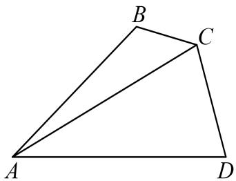

<!-- question-source:start -->
2、在 $\triangle ABC$ 中，角 $A, B, C$ 的对边分别为 $a, b, c, a = 1$ ，且 $b\cos C + \sqrt{3} c\sin B = 1 + 2c$

1 求 $\angle B$ 的大小

如图所示， $D$ 为 $\triangle ABC$ 外一点， $\angle DCB = \angle B$ ， $CD = \sqrt{3}$ ， $AC = AD$ ，求 $\triangle ACD$ 外接圆半径 $\pmb{R}$ 的长
<!-- question-source:end -->

![[Q00091225A1]]
