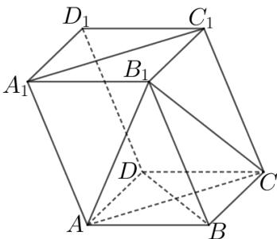

<!-- question-source:start -->
3、如图，在平行六面体 $ABCD - A_{1}B_{1}C_{1}D_{1}$ 中，底面 $ABCD$ 是边长为2的正方形，棱 $AA_{1} = 3$ ，且 $\angle A_{1}AB = \angle A_{1}AD = 120^{\circ}$

1 求证： $BD \perp$ 平面 $ACC_{1}A_{1}$

2 求平面 $AB_{1}C$ 与平面 $ACC_{1}A_{1}$ 夹角的余弦值
<!-- question-source:end -->

![[Q00091226A1]]
