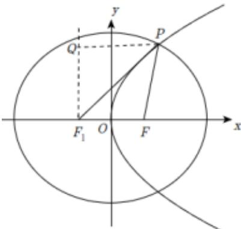

> [!faq]- 2026年内蒙古包头市高考数学二模试卷解析
>
> > [!success]- **【答案】** $\frac{1}{3}$
>
> > [!note]- **【解析】**
> > 已知椭圆 $C: \frac{x^2}{a^2} + \frac{y^2}{b^2} = 1 (a > b > 0)$ 与抛物线
> >
> > $\Gamma : y^{2} = 2px (p > 0)$ 有相同的焦点 $F(1,0)$ ,
> >
> > 由焦点 $F(1,0)$ ，得 $c=\frac{p}{2}=1$ ，p=2，
> >
> > 所以抛物线的方程为 $y^{2}=4x$ ，准线为x=-1，
> >
> > 设 $P$ 点的横坐标为 $\pmb{x}$ ，根据抛物线的定义可得：
> >
> > $|PF| = x + 1 = \frac{5}{2}$ ，得 $x = \frac{3}{2}$ ，代入抛物线方程可得 $P(\frac{3}{2}, \sqrt{6})$ ，
> >
> > 设椭圆的左焦点为 $F_{1}(-1,0)$
> >
> > 
> >
> > 有 $\left|PF_{1}\right|=\sqrt{\left(\frac{3}{2}+1\right)^{2}+\left(\sqrt{6}-0\right)^{2}}=\frac{7}{2}$ ，
> >
> > $$
> > 2 a = | P F _ {1} | + | P F | = \frac {5}{2} + \frac {7}{2} = 6
> > $$
> >
> > 可得椭圆 $C$ 的离心率为 $e = \frac{c}{a} = \frac{1}{3}$ .
> >
> > 故答案为： $\frac{1}{3}$ .
