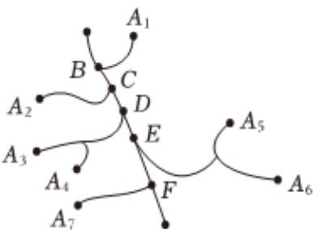

<!-- question-source:start -->
8、某市一个经济开发区的公路路线图如图所示，粗线是大公路，细线是小公路，七个公司 $A_{1}, A_{2}, A_{3}, A_{4}, A_{5}, A_{6}, A_{7}$ 分布在大公路两侧，有一些小公路与大公路相连。现要在大公路上设一快递中转站，中转站到各公司（沿公路走）的距离总和越小越好，则这个中转站最好设在（）

A 路口C

B 路口D

C 路口E

D 路口F

<!-- question-source:end -->

![[Q00091236A1]]
