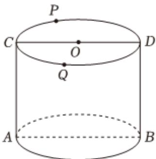

<!-- question-source:start -->
2、如图所示圆柱，ABDC为其轴截面，P、Q为其上底圆周上两个动点，圆柱底面半径和高都为2，下列说法正确的是（）

A 圆柱面上从点 $A$ 到点 $D$ 最短路径为椭圆曲线  
B 圆柱面上从点 $A$ 到点 $D$ 最短路径长度为 $2\sqrt{\pi^2 + 1}$ C 过 $AD$ 作截面与圆柱面的交线为椭圆，当椭圆短轴垂直于轴截面 $ABDC$ 时，椭圆离心率为 $\frac{\sqrt{5}}{5}$ D 设 $PQ$ 垂直于轴截面 $ABDC$ ，四面体 $PAQD$ 体积最大值为 $2\sqrt{3}$
<!-- question-source:end -->

![[Q00091238A1]]
