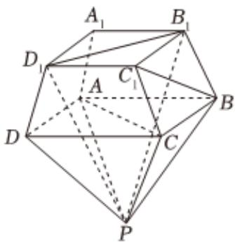

<!-- question-source:start -->
3、如图为正四棱台 $ABCD - A_{1}B_{1}C_{1}D_{1}$ 与正四棱锥 $P - ABCD$ 拼接而成的几何体

1 证明： $AC \perp$ 平面 $PB_{1}D_{1}$

2 若该四棱台的高为2， $A_{1}B_{1} = 3$ ， $AB = 4$ ， $PA = 2\sqrt{6}$ ，求二面角 $P - BC - C_1$ 的正弦值
<!-- question-source:end -->

![[Q00091245A1]]
