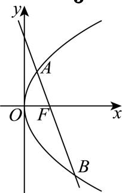

> [!faq]- 2026年内蒙古通辽市科尔沁九中等校高考数学冲刺压轴训练试卷解析
>
> > [!success]- **【答案】** B
>
> > [!note]- **【解析】**
> > 设 $A(x_{1},y_{1})$ ， $B(x_{2},y_{2})$ ， $F(1,0)$ ，
> >
> > 由直线 $l$ 与 $C$ 交于两个不同的点 $A, B$ , 且 $F$ 为线段 $AB$ 的一个三等分点,
> >
> > 不妨设 $\overrightarrow{AF} = \frac{1}{3}\overrightarrow{AB}$ ，则 $(1 - x_{1}, - y_{1}) = \frac{1}{3}(x_{2} - x_{1},y_{2} - y_{1})$
> >
> > 可得 $\frac{x_2 + 2x_1}{3} = 1, y_2 + 2y_1 = 0$
> >
> > 
> >
> > 令 $y_{1}=t$ ， $y_{2}=-2t$ ，得 $x_{1}=\frac{t^{2}}{4}$ ， $x_{2}=t^{2}$ ，
> >
> > 则 $\frac{t^2 + \frac{t^2}{2}}{3} = 1$ ，可得 $t^2 = 2$
> >
> > 则 $k=\frac{y_{2}-y_{1}}{x_{2}-x_{1}}=\frac{-3t}{\frac{3t^{2}}{4}}=-\frac{4}{t}$ ， $k^{2}=(-\frac{4}{t})^{2}=\frac{16}{t^{2}}=8.$
> >
> > 故选：B.
