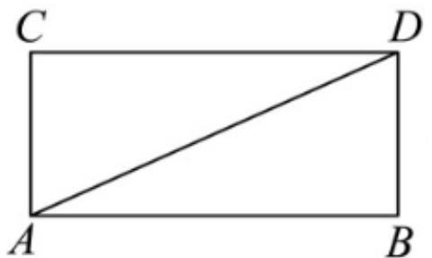
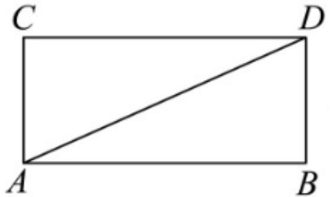
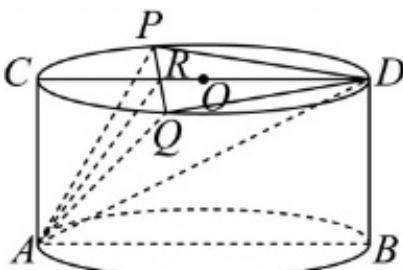

> [!faq]- 2026年内蒙古通辽市科尔沁九中等校高考数学冲刺压轴训练试卷解析
>
> > [!success]- **【答案】** CD
>
> > [!note]- **【解析】**
> > 对于AB，两点之间线段最短，所以有两种可能的最短路径，
> >
> > 如下图：设ABCD是侧面展开，则 $AB=2\pi$ ，BD=2，
> >
> > 
> >
> > 此时 $AD = \sqrt{4 + 4\pi^2} = 2\sqrt{\pi^2 + 1}$
> >
> > 如下图：设ABCD是圆柱轴截面，则AB=4，BD=2，
> >
> > 
> >
> > 此时 $AC + CD = 6$ ，因为 $2\sqrt{\pi^2 + 1} - 6 = 2(\sqrt{\pi^2 + 1} - 3) > 0$
> >
> > 所以圆柱面上从点 $A$ 到点 $D$ 最短路径不是椭圆曲线，且最短路径长度也不是 $2\sqrt{\pi^2 + 1}$ ，故 $AB$ 错误；
> >
> > 对于 $C$ ，过 $AD$ 作截面与圆柱面的交线为椭圆，当椭圆短轴垂直于轴截面ABDC时，
> >
> > $2b = 2R = 4$ ， $2a = \sqrt{2^2 + 4^2} = 2\sqrt{5}$ ，解得 $a = \sqrt{5}$ ， $b = 2$ ， $c = 1$
> >
> > 所以离心率为 $e = \frac{c}{a} = \frac{1}{\sqrt{5}} = \frac{\sqrt{5}}{5}$ ，故 $C$ 正确；
> >
> > 对于D，如图，设 $PQ \cap CD = R$ ， $\angle PDC = \theta$ ， $\theta \in (0, \frac{\pi}{2})$ ，
> >
> > 
> >
> > 四面体PAQD体积 $V = \frac{1}{3} PR\bullet S_{\Delta ARD} + \frac{1}{3} RQ\bullet S_{\Delta ARD} = \frac{2}{3} PR\bullet S_{\Delta ARD}$
> >
> > $$
> > = \frac {2}{3} \times 4 c o s \theta s i n \theta \times (\frac {1}{2} \times 4 c o s ^ {2} \theta \times 2) = \frac {8}{3} s i n 2 \theta (c o s 2 \theta + 1)
> > $$
> >
> > 所以 $V^{2} = \frac{64}{27}\times 3(1 - cos^{2}2\theta)(cos2\theta +1)^{2}$
> >
> > $$
> > = \frac {6 4}{2 7} (1 + \cos 2 \theta) ^ {3} \times (3 - 3 \cos 2 \theta) \leq \frac {6 4}{2 7} \left(\frac {3 + 3 \cos 2 \theta + 3 - 3 \cos 2 \theta}{4}\right) ^ {4} = 1 2,
> > $$
> >
> > 所以 $V \leq 2\sqrt{3}$ ，等号成立当且仅当 $cos2\theta = \frac{1}{2}$ ，即 $\theta = \frac{\pi}{6}$ ，故 $D$ 正确.
> >
> > 故选：CD.
