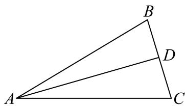

> [!faq]- 2026年内蒙古通辽市科尔沁九中等校高考数学冲刺压轴训练试卷解析
>
> > [!success]- **【答案】** 详见解析
>
> > [!note]- **【解析】**
> > 详见解析
> >
> > (1)因为 $\frac{a}{\cos A} = \frac{2c - b}{\cos B}$ ，可得 $a\cos B = 2c\cos A - b\cos A$
> >
> > 所以 $\sin A\cos B = 2\sin C\cos A - \sin B\cos A$ ，可得
> >
> > $$
> > \sin (A + B) = 2 \sin C \cos A
> > $$
> >
> > 
> >
> > 又由于 $\sin (A + B) = \sin (\pi -C) = \sin C$
> >
> > 可得cosA= $\frac{1}{2}$ ，
> >
> > 所以 $A=\frac{\pi}{3}$ ;
> >
> > (2)由题意， $BC=\sqrt{2}$ ，BC边中线AD长为1，
> >
> > 可得 $\overrightarrow{AD} = \frac{1}{2} (\overrightarrow{AB} +\overrightarrow{AC})$
> >
> > 将等式两边平方得 $1 = \frac{1}{4} (b^2 + c^2 + 2bc \cdot \cos A) = \frac{1}{4} (b^2 + c^2 + bc)$ ，
> >
> > 又因为 $a^{2}=b^{2}+c^{2}-2bc\cos A$ ，可得 $2=b^{2}+c^{2}-bc$ ，
> >
> > 解得bc=1，
> >
> > 可得 $S_{\triangle ABC} = \frac{1}{2} bcsin A = \frac{\sqrt{3}}{4}$
