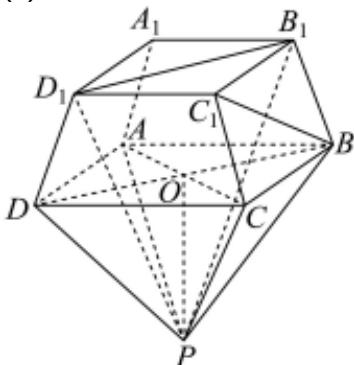
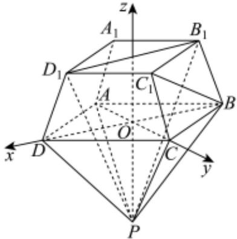

> [!faq]- 2026年内蒙古通辽市科尔沁九中等校高考数学冲刺压轴训练试卷解析
>
> > [!success]- **【答案】** 详见解析
>
> > [!note]- **【解析】**
> > 详见解析
> >
> > (1)证明：记 $AC$ 与 $BD$ 的交点为 $O$ ，由 $PO \perp$ 平面 $ABCD$ ， $AC \subset$ 平面 $ABCD$
> >
> > 
> >
> > 可知 $AC \perp PO$ ，
> >
> > 而 $AC \perp BD, PO \cap BD = O, PO \subset$ 平面PBD, BD ⊂ 平面PBD, 故AC⊥平面PBD,
> >
> > 由题易得平面 $PB_{1}D_{1}$ 与平面PBD为同一平面，故 $AC \perp$ 平面 $PB_{1}D_{1}$ ；
> >
> > (2)显然 $PO = \sqrt{PA^2 - (\frac{\sqrt{2}}{2} AB)^2} = 4$
> >
> > 以O为坐标原点， $\overrightarrow{OD}$ 的方向为x轴正方向， $\overrightarrow{OC}$ 的方向为y轴正方向， $\overrightarrow{PO}$ 的方向为z轴正方向，建立空间直角坐标系O-xyz，
> >
> > 
> >
> > 则 $C(0, 2\sqrt{2}, 0), B(-2\sqrt{2}, 0, 0), P(0, 0, -4), C_1(0, \frac{3\sqrt{2}}{2}, 2)$
> >
> > $$
> > \text {则} \overrightarrow {B C} = (2 \sqrt {2}, 2 \sqrt {2}, 0), \overrightarrow {P C} = (0, 2 \sqrt {2}, 4), \overrightarrow {C _ {1} C} = (0, \frac {\sqrt {2}}{2}, - 2),
> > $$
> >
> > 记平面PBC与平面BCC的法向量分别为 $\overrightarrow{n}_{1}=(x_{1},y_{1},z_{1})$ ， $\overrightarrow{n}_{2}=(x_{2},y_{2},z_{2})$ ，
> >
> > 则 $\left\{ \begin{array}{l} \overrightarrow{n}_{1} \cdot \overrightarrow{BC} = 0 \\ \overrightarrow{n}_{1} \cdot \overrightarrow{PC} = 0 \end{array} \right.$ ，即 $\left\{ \begin{array}{l} x_{1} + y_{1} = 0 \\ y_{1} + \sqrt{2} z_{1} = 0 \end{array} \right.$
> >
> > 令 $z_{1} = 1$ ，则 $y_{1} = -\sqrt{2}, x_{1} = \sqrt{2}$
> >
> > 所以取 $\overrightarrow{n}_{1} = (\sqrt{2}, -\sqrt{2}, 1)$
> >
> > 又 $\left\{ \begin{array}{l}\overrightarrow{n}_2\cdot \overrightarrow{BC} = 0\\ \overrightarrow{n}_2\cdot \overrightarrow{C_1C} = 0 \end{array} \right.$ ，即 $\left\{ \begin{array}{l}x_{2} + y_{2} = 0\\ y_{2} - 2\sqrt{2} z_{2} = 0 \end{array} \right.$
> >
> > 令 $z_{2} = 1$ ，则 $y_{2} = 2\sqrt{2}$ ， $x_{2} = -2\sqrt{2}$
> >
> > 所以取 $\overrightarrow{n}_{2} = (-2\sqrt{2}, 2\sqrt{2}, 1)$
> >
> > 记二面角 $P - BC - C$ 的平面角为 $\theta$ ，
> >
> > $$
> > | c o s \theta | = \frac {| \overrightarrow {n} _ {1} \cdot \overrightarrow {n} _ {2} |}{| \overrightarrow {n} _ {1} | | \overrightarrow {n} _ {2} |} = \frac {7}{\sqrt {5} \times \sqrt {1 7}} = \frac {7 \sqrt {8 5}}{8 5}
> > $$
> >
> > 可知 $sin\theta = \sqrt{1 - cos^2\theta} = \frac{6\sqrt{85}}{85}$
> >
> > 所以二面角 $P - BC - C_{1}$ 的正弦值为 $\frac{6\sqrt{85}}{85}$ .
