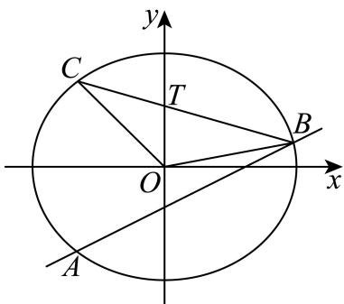

> [!faq]- 2026年内蒙古通辽市科尔沁九中等校高考数学冲刺压轴训练试卷解析
>
> > [!success]- **【答案】** 详见解析
>
> > [!note]- **【解析】**
> > 详见解析
> >
> > ( I ) 因为椭圆E的离心率为 $\frac{1}{2}$ ，
> >
> > 所以 $\frac{\sqrt{a^2 - b^2}}{a} = \frac{1}{2}$
> >
> > 解得 $\frac{b^2}{a^2} = \frac{3}{4}$ ，①
> >
> > 因为点 $P(1, \frac{3}{2})$ 在椭圆 $\pmb{E}$ 上，
> >
> > 所以 $\frac{1}{a^2} +\frac{9}{4b^2} = 1$ ，②
> >
> > 联立①②
> >
> > 解得 $a^{2}=4$ , $b^{2}=3$
> >
> > 则椭圆 $E$ 的方程为 $\frac{x^2}{4} +\frac{y^2}{3} = 1$
> >
> > （Ⅱ）证明：设 $A(x_{1},y_{1})$ ， $B(x_{2},y_{2})$ ，
> >
> > 可得 $C(x_{1}, -y_{1})$ ,
> >
> > 联立 $\left\{\begin{aligned}y&=\frac{1}{2}x+m\\ \frac{x^{2}}{4}&+\frac{y^{2}}{3}=1\end{aligned}\right.$ ，消去y并整理得 $x^{2}+mx+m^{2}-3=0$ ，
> >
> > 此时 $\Delta = m^2 - 4(m^2 - 3) > 0$
> >
> > 解得 $m^{2}<3$ ，
> >
> > 由韦达定理得 $x_{1} + x_{2} = -m$ ， $x_{1}x_{2} = m^{2} - 3$ 则 $S_{\triangle BOC} = \frac{1}{2} |OB||OC|sin\angle BOC = \frac{1}{2} |\overrightarrow{OB} ||\overrightarrow{OC} |\cdot \sqrt{1 - cos^2\angle BOC}$ $= \frac{1}{2}\sqrt{(|\overrightarrow{OB} ||\overrightarrow{OC}|)^2 - (\overrightarrow{OB}\cdot\overrightarrow{OC})^2} = \frac{1}{2}\sqrt{(x_1^2 + y_1^2)(x_2^2 + y_2^2) - (x_1x_2 - y_1y_2)^2}$ $= \frac{1}{2}|x_{1}y_{2} + x_{2}y_{1}| = \frac{1}{2}|x_{1}(\frac{1}{2} x_{2} + m) + x_{2}(\frac{1}{2} x_{1} + m)|$ $= \frac{1}{2}|x_1x_2 + m(x_1 + x_2)| = \frac{1}{2}|m^2 -3 - m^2| = \frac{3}{2},$
> >
> > 故 $\triangle BOC$ 的面积为定值；
> >
> > （Ⅲ）因为点B在直线AC的右侧，
> >
> > 所以 $x_{2}>x_{1}$
> >
> > 设直线BC与y轴的交点为 $T(0,t)$ ，
> >
> > 当 $x_{1}x_{2}=0$ 时，点B，C中有一个点与椭圆E的上顶点重合，
> >
> > 此时 $T$ 即为 $\pmb{E}$ 的上顶点， $t = \sqrt{3}$
> >
> > 当 $x_{1}x_{2}\neq0$ 时，
> >
> > 因为 $B, C, T$ 共线，
> >
> > 所以 $\frac{y_2 - t}{x_2} = \frac{-y_1 - t}{x_1}$
> >
> > 整理得 $t = \frac{-x_1x_2 - m(x_1 + x_2)}{x_2 - x_1} = \frac{3}{x_2 - x_1} >0$
> >
> > 因为 $x_{2} - x_{1} = \sqrt{(x_{1} + x_{2})^{2} - 4x_{1}x_{2}}$
> >
> > $$
> > = \sqrt {m ^ {2} - 4 (m ^ {2} - 3)} = \sqrt {1 2 - 2 m ^ {2}} \leqslant 2 \sqrt {3},
> > $$
> >
> > 当且仅当 $m = 0$ 时，等号成立，
> >
> > 此时 $t \geqslant \frac{\sqrt{3}}{2}$ .
> >
> > 则直线BC在y轴上的截距的最小值为 $\frac{\sqrt{3}}{2}$ .
> >
> > 
