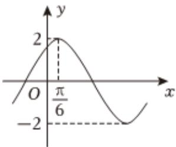

<!-- question-source:start -->
2、函数 $f(x)=2\sin(2\omega x+\frac{\pi}{3})(0<\omega\leqslant1)$ 的图象如图所示，则下列说法中正确的是（）

$$
(- \frac {\pi}{3}
$$

$$
\frac {\pi}{3}
$$

$$
g (x) = 2 \cos \left(x + \frac {\pi}{6}\right)
$$

$$
f (2 x) = m \text {在} [ 0, \frac {\pi}{2} ]
$$

$$
[ \sqrt {3}
$$
<!-- question-source:end -->

![[Q00091257A1]]
