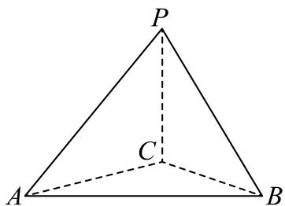

<!-- question-source:start -->
4、如图，在三棱锥 $P - ABC$ 中，平面 $PBC \perp$ 平面 $ABC$ ， $CP = CA = CB = 2$ ， $PB = 2\sqrt{2}$

1 证明：平面 $PAC \perp$ 平面 $ABC$

2 已知平行于 $AC$ ， $PB$ 的平面将三棱锥 $P - ABC$ 截为两部分，求截面面积的最大值

3 若二面角 $B - AP - C$ 的大小为 $45^{\circ}$ ，求 $\angle ACB$ 的余弦值
<!-- question-source:end -->

![[Q00091265A1]]
