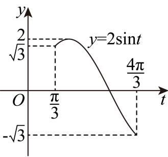

> [!faq]- 2026年内蒙古鄂尔多斯市高考数学一模试卷解析
>
> > [!success]- **【答案】** BC
>
> > [!note]- **【解析】**
> > 由题意： $2\sin(2\omega \times \frac{\pi}{6} + \frac{\pi}{3}) = 2 \Rightarrow \frac{\omega\pi}{3} + \frac{\pi}{3} = 2k\pi + \frac{\pi}{2}, k \in Z,$ 又 $0<\omega\leqslant1$ ，所以k=0， $\omega=\frac{1}{2}$ ，故A错误；
> > 对B：因为 $f(x)=2\sin(x+\frac{\pi}{3})$ ，所以 $f(-\frac{\pi}{3})=0$ ，所以 $y=f(x)$ 的图象关于点 $(- \frac{\pi}{3}, 0)$ 对称，故B正确；
> >
> > 
> >
> > 对 $C$ ：将 $\pmb {y} = \pmb {f}\left(\pmb {x}\right)$ 的图象向左平移 $\frac{\pi}{3}$ 个单位长度，可得：
> >
> > $g(x) = f(x + \frac{\pi}{3}) = 2sin(x + \frac{\pi}{3} +\frac{\pi}{3}) = 2sin(x + \frac{2\pi}{3}) = 2sin(\frac{\pi}{2} +x + \frac{\pi}{6})$ $= 2cos(x + \frac{\pi}{6})$ ，故 $C$ 正确；
> >
> > 对 $D: f(2x) = 2\sin \left(2x + \frac{\pi}{3}\right)$ ，当 $x \in [0, \frac{\pi}{2}]$ 时， $2x + \frac{\pi}{3} \in [\frac{\pi}{3}, \frac{4\pi}{3}]$ .
> >
> > 设 $2x + \frac{\pi}{3} = t$ ， $t\in [\frac{\pi}{3},\frac{4\pi}{3} ]$ ，若要 $2\sin t = m$ 在 $[\frac{\pi}{3},\frac{4\pi}{3} ]$ 上有两个不相等的实数根，
> >
> > 由图可得 $\sqrt{3} \leqslant m < 2$ ，故 $D$ 错误.
> >
> > 故选：BC.
