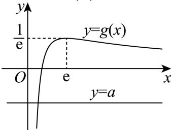

> [!faq]- 2026年内蒙古鄂尔多斯市高考数学一模试卷解析
>
> > [!success]- **【答案】** $(-∞,0]$
>
> > [!note]- **【解析】**
> > 由题 $f'(x)=\ln x+1-ax-1=\ln x-ax.$
> >
> > 由函数 $f(x)=x\ln x-\frac{1}{2}ax^{2}-x$ 恰有1个极值点，得 $\ln x-ax=0$ 恰有一个变号实数根.
> >
> > 即方程 $a = \frac{lnx}{x}$ 恰有一个变号实数根.
> >
> > 令 $g(x)=\frac{lnx}{x}$ ，则直线y=a与函数 $y=g(x)$ 的图象恰有一个交点.
> >
> > $g^{\prime}(x) = \frac{\frac{1}{x}\cdot x - \ln x}{x^{2}} = \frac{1 - \ln x}{x^{2}}.$
> >
> > 当 $x \in (0, e)$ 时， $\ln x < 1$ ， $1 - \ln x > 0$ ， $g'(x) > 0$ ，函数 $g(x)$ 单调递增；
> >
> > 当 $x\in(e,+\infty)$ 时， $\ln x>1$ ， $1-\ln x<0$ ， $g'(x)<0$ ，函数 $g(x)$ 单调递减.
> >
> > 因此当 $x = e$ 时， $g(x)$ 取得极大值，即最大值为 $g(e) = \frac{1}{e}$ .
> >
> > 又当 $x\to+\infty$ 时， $\ln x\to+\infty$ ，因此 $g(x)>0$ ; $g(1)=0$
> >
> > 因此函数 $g(x)$ 的图象如下：
> >
> > 
> >
> > 因此 $a \leqslant 0$ 或 $a = \frac{1}{e}$ .
> >
> > 当 $a=\frac{1}{e}$ 时， $f'(x)=\ln x-\frac{x}{e}$ .
> >
> > 令 $h(x)=f'(x)$ ，则 $h'(x)=\frac{1}{x}-\frac{1}{e}$ ，在 $(0,+\infty)$ 上单调递减.
> >
> > 当 $x\in(0,e)$ 时， $h'(x)>0$ ，函数 $h(x)$ 单调递增；
> >
> > 当 $x\in(e,+\infty)$ 时， $h^{\prime}(x)<0$ ，函数 $h(x)$ 单调递减.
> >
> > 因此当 $x = e$ 时， $h(x)$ 取得极大值，即最大值为 $h(e) = 0$ ，即 $f'(x) = h(x) \leqslant 0$ 恒成立.
> >
> > 因此 $f(x)$ 是减函数，无极值点.
> >
> > 因此实数a的取值范围为 $(-∞,0]$ .
> >
> > 故答案为： $(-∞,0]$ .
