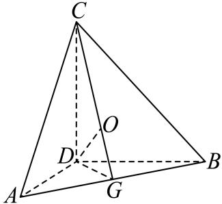
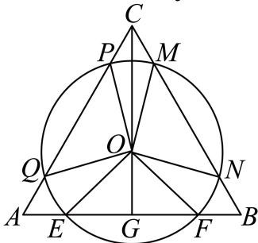
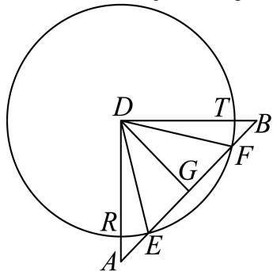

> [!faq]- 2026年内蒙古鄂尔多斯市高考数学一模试卷解析
>
> > [!success]- **【答案】** $(\frac{\sqrt{6}}{6} +\frac{\sqrt{3}}{3})\pi$
>
> > [!note]- **【解析】**
> > 因为 $DA$ ， $DB$ ， $DC$ 两两垂直， $DA = DB = DC = \sqrt{2}$
> >
> > 所以 $AB = AC = BC = \sqrt{2 + 2} = 2$
> >
> > 因为三棱锥 $D - ABC$ 为正三棱锥，
> >
> > 所以顶点D在底面ABC上的投影为 $\triangle ABC$ 的中心O.
> >
> > 取AB的中点G，则C，O，G三点共线，连接DG，
> >
> > 
> >
> > 由题意得 $AG = BG = 1, DG = 1, CG = \sqrt{4 - 1} = \sqrt{3}, DO = \frac{CD \cdot DG}{CG} = \frac{\sqrt{6}}{3}$
> >
> > $$
> > O G = \sqrt {D G ^ {2} - O D ^ {2}} = \frac {\sqrt {3}}{3}
> > $$
> >
> > 因为 $\sqrt{\left(\frac{2\sqrt{3}}{3}\right)^2 - DO^2} = \frac{\sqrt{6}}{3}$ ，而 $\frac{\sqrt{6}}{3} > OG = \frac{\sqrt{3}}{3}$
> >
> > 所以以 $D$ 为球心， $\frac{2\sqrt{3}}{3}$ 为半径的球与底面 $ABC$ 相交于三段圆弧，如图，分别为 $\widehat{EQ},\widehat{FN},\widehat{PM}$
> >
> > 
> >
> > 其中 $OE = OF = OQ = OP = OM = ON = \frac{\sqrt{6}}{3}$
> >
> > 所以 $EG=\sqrt{OE^{2}-OG^{2}}=\frac{\sqrt{3}}{3}$ ，
> >
> > 同理 $FG=\frac{\sqrt{3}}{3}$ ，
> >
> > 所以 $\angle EOG = \angle FOG = \frac{\pi}{4}$ ，故 $\angle EOF = \frac{\pi}{2}$
> >
> > 同理 $\angle POQ = \angle MON = \frac{\pi}{2}$
> >
> > 所以 $\angle EOQ + \angle NOF + \angle MOP = 2\pi -\frac{3\pi}{2} = \frac{\pi}{2}$
> >
> > 所以 $\widehat{EQ} +\widehat{FN} +\widehat{PM} = \frac{\pi}{2}\cdot \frac{\sqrt{6}}{3} = \frac{\sqrt{6}}{6}\pi ,$
> >
> > 由于 $\sqrt{2} >\frac{2\sqrt{3}}{3} >1$
> >
> > 所以以 $D$ 为球心， $\frac{2\sqrt{3}}{3}$ 为半径的球与底面ABD边AD，BD分别相交于R，T，
> >
> > 则 $\widehat{RE}$ ， $\widehat{FT}$ 即为球与底面ABD的交线，
> >
> > 因为 $EG = FG = \frac{\sqrt{3}}{3}$
> >
> > 所以 $\sin\angle EDG=\frac{EG}{DE}=\frac{1}{2}$
> >
> > 所以 $\angle EDG = \frac{\pi}{6}$
> >
> > 所以 $\angle FDG = \frac{\pi}{6}$ ， $\angle EDF = \frac{\pi}{3}$
> >
> > 所以 $\angle RDE + \angle TDF = \frac{\pi}{2} -\frac{\pi}{3} = \frac{\pi}{6}$
> >
> > 所以 $\widehat{RE} +\widehat{FT} = \frac{\pi}{6}\cdot \frac{2\sqrt{3}}{3} = \frac{\sqrt{3}}{9}\pi ,$
> >
> > 所以以 $D$ 为球心， $\frac{2\sqrt{3}}{3}$ 为半径的球与底面 $DAC$ ， $DBC$ 的交线长度也为 $\frac{\sqrt{3}}{9}\pi$
> >
> > 所以交线的长度和 $\frac{\sqrt{6}}{6}\pi +\frac{\sqrt{3}}{9}\pi \times 3 = (\frac{\sqrt{6}}{6} +\frac{\sqrt{3}}{3})\pi .$
> >
> > 故答案为： $(\frac{\sqrt{6}}{6} +\frac{\sqrt{3}}{3})\pi$
> >
> > 
