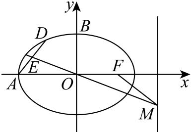

> [!faq]- 2026年内蒙古鄂尔多斯市高考数学一模试卷解析
>
> > [!success]- **【答案】** 详见解析
>
> > [!note]- **【解析】**
> > 详见解析
> >
> > (1)椭圆 $C: \frac{x^2}{a^2} + \frac{y^2}{b^2} = 1 (a > b > 0)$ 的右焦点为 $F$ ，左顶点为 $A$ ，上顶点为 $B$ ，离心率为 $\frac{\sqrt{2}}{2}$ ，则 $\left\{ \begin{array}{c} \frac{c}{a} = \frac{\sqrt{2}}{2} \\ a^2 = b^2 + c^2 \\ \frac{1}{2}(a + c)b = \frac{\sqrt{2} + 1}{2} \end{array} \right.$ ，解得 $a = \sqrt{2}, b = 1, c = 1$ ，故椭圆 $C$ 的方程为 $\frac{x^2}{2} + y^2 = 1$ 。  
> > (2)(i)由(1)得 $A(-\sqrt{2}, 0)$ ，设 $D(x_0, y_0)(y_0 \neq 0)$ ， $E$ 为 $AD$ 中点，故 $E\left(\frac{x_0 - \sqrt{2}}{2}, \frac{y_0}{2}\right)$ ，直线 $OE$ 过原点和 $E$ ，斜率 $k_{OE} = \frac{y_0}{x_0 - \sqrt{2}}$ ，已知 $OE$ 过 $M(2, -2)$ ，故 $k_{OE} = \frac{-2}{2} = -1$ ，所以 $\frac{y_0}{x_0 - \sqrt{2}} = -1$ ，即 $y_0 = \sqrt{2} - x_0$ ，代入椭圆方程 $\frac{x_0^2}{2} + y_0^2 = 1$ ，整理得 $3x_0^2 - 4\sqrt{2}x_0 + 2 = 0$ ，解得 $x_0 = \sqrt{2}$ （舍去，对应 $y_0 = 0$ ，点 $D$ 在 $x$ 轴上）或 $x_0 = \frac{\sqrt{2}}{3}$ ，得 $y_0 = \frac{2\sqrt{2}}{3}$ ，
> >
> > 故点 $D$ 的坐标为 $\left(\frac{\sqrt{2}}{3}, \frac{2\sqrt{2}}{3}\right)$ ，又点 $A$ 的坐标为 $\left(-\sqrt{2}, 0\right)$ ，
> >
> > 所以 $|AD|=\sqrt{\left(\frac{\sqrt{2}}{3}+\sqrt{2}\right)^{2}+\left(\frac{2\sqrt{2}}{3}-0\right)^{2}}=\frac{2\sqrt{10}}{3}$
> >
> > (ii)证明：由(1)得 $F(1,0)$ ，设 $D(x_{0},y_{0})(y_{0}\neq0)$ ，
> >
> > 由(i)直线OE方程为 $y=\frac{y_{0}}{x_{0}-\sqrt{2}}x$ ，取x=2可得 $y=\frac{2y_{0}}{x_{0}-\sqrt{2}}$
> >
> > 所以直线OE与x=2交点为 $M(2,\frac{2y_{0}}{x_{0}-\sqrt{2}})$ ,
> >
> > 因为 $AD$ 的斜率 $\pmb{k}_{AD} = \frac{y_0}{x_0 + \sqrt{2}}$ ，直线 $MF$ 的斜率 $\pmb{k}_{MF} = \frac{\frac{2y_0}{x_0 - \sqrt{2}} - 0}{2 - 1} = \frac{2y_0}{x_0 - \sqrt{2}}$
> >
> > 所以 $k_{AD}k_{MF}=\frac{y_{0}}{x_{0}+\sqrt{2}}\cdot\frac{2y_{0}}{x_{0}-\sqrt{2}}=\frac{2y_{0}^{2}}{x_{0}^{2}-2}$
> >
> > 由 $D$ 在椭圆上得 $\frac{x_0^2}{2} + y_0^2 = 1$
> >
> > 所以 $k_{AD}k_{MF} = -1$
> >
> > 所以 $MF \perp AD.$
> >
> > 
