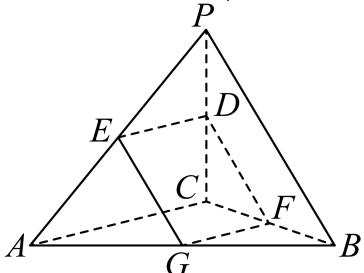
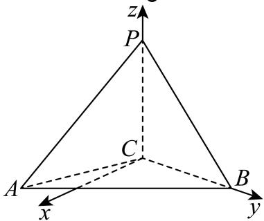

> [!faq]- 2026年内蒙古鄂尔多斯市高考数学一模试卷解析
>
> > [!success]- **【答案】** 详见解析
>
> > [!note]- **【解析】**
> > 详见解析
> >
> > (1)证明：由 $CP = CB = 2$ ， $PB = 2\sqrt{2}$ ，则 $CP^2 +CB^2 = PB^2$ ，即 $CP\bot CB$
> >
> > 由平面 $PBC \perp$ 平面 $ABC$ ，平面 $PBC \cap$ 平面 $ABC = BC$ ， $CP \subset$ 平面 $PBC$
> >
> > 所以 $CP \perp$ 平面ABC， $CP \subset$ 平面PAC，则平面 $PAC \perp$ 平面ABC.
> >
> > (2)设平行于 $AC$ ， $PB$ 的截面DEGF与 $PC$ ， $PA$ ， $BC$ ， $AB$ 的交点分别为 $D$ ， $E$ ， $F$ ， $G$
> >
> > 因为 $AC //$ 平面DEGF， $AC \subset$ 平面PAC，平面 $PAC \cap$ 平面DEGF = DE
> >
> > 所以 $AC // DE$ ，同理可得 $AC // GF$ ，所以 $DE // GF$ ，同理可证 $GE // FD$
> >
> > 所以四边形DEGF为平行四边形，
> >
> > 令 $\frac{CD}{CP} = \lambda \in (0,1)$ ，则 $\frac{DP}{CP} = 1 - \lambda$
> >
> > 所以 $DF = \lambda PB = 2\sqrt{2}$ ， $DE = (1 - \lambda)AC = 2(1 - \lambda)$
> >
> > 又截面DEGF始终为平行四边形，
> >
> > 所以 $S_{DEGF} = 2\times \frac{1}{2} DE\times DF\times sin\angle EDF = 4\sqrt{2}\lambda (1 - \lambda)sin\angle EDF$
> >
> > $$
> > = [ - 4 \sqrt {2} (\lambda - \frac {1}{2}) ^ {2} + \sqrt {2} ] s i n \angle E D F
> > $$
> >
> > 要使截面DEGF的面积最大，只需 $\lambda = \frac{1}{2}$ 且 $\sin \angle EDF = 1$
> >
> > 此时 $S_{DEGF}=\sqrt{2}$ 最大；
> >
> > 
> >
> > (3)由(1) $CP\perp$ 平面ABC，在平面ABC内作 $Cx\perp BC$ ，如下图示，
> >
> > 可构建如图示的空间直角坐标系C-xyz，
> >
> > 设 $\angle ACB = \theta \in (0,\pi)$ ，则 $A(2\sin \theta ,2\cos \theta ,0)$ ， $B(0,2,0)$ ， $P(0,0,2)$
> >
> > $$
> > \overrightarrow {C A} = (2 \sin \theta , 2 \cos \theta , 0), \overrightarrow {P A} = (2 \sin \theta , 2 \cos \theta , - 2), \overrightarrow {P B} = (0, 2, - 2), \overrightarrow {C P} (0, 0, 2)
> > $$
> >
> > 设平面PAC的法向量为 $\overrightarrow{m}=(x,y,z)$ ,
> >
> > $$
> > \left\{ \begin{array}{l} \overrightarrow {m} \cdot \overrightarrow {C A} = 2 s i n \theta \cdot x + 2 y \cdot c o s \theta = 0 \\ \overrightarrow {m} \cdot \overrightarrow {C P} = 2 z = 0 \end{array} \right.
> > $$
> >
> > 令 $x=\cos\theta$ ，得 $y=-\sin\theta$ ，z=0，
> >
> > 所以平面 $PAC$ 的法向量为 $\overrightarrow{m} = (\cos \theta, -\sin \theta, 0)$
> >
> > 设平面 $PAB$ 的法向量为 $\overrightarrow{n} = (a, b, c)$
> >
> > $$
> > \left\{ \begin{array}{l} \overrightarrow {n} \cdot \overrightarrow {P A} = 2 s i n \theta \cdot a + 2 b \cdot c o s \theta - 2 c = 0 \\ \overrightarrow {n} \cdot \overrightarrow {P B} = 2 b - 2 c = 0 \end{array} \right.
> > $$
> >
> > 令 $b=\sin\theta$ ，得 $a=1-\cos\theta$ ， $c=\sin\theta$ ，
> >
> > 所以平面PAB的法向量为 $\overrightarrow{n} = (1 - \cos\theta, \sin\theta, \sin\theta)$ ,
> >
> > 由二面角 $B - AP - C$ 的大小为 $45^{\circ}$
> >
> > $$
> > \cos \mathrm {\Omega} <   \overrightarrow {m}, \overrightarrow {n} > | = \frac {| \overrightarrow {m} \cdot \overrightarrow {n} |}{| \overrightarrow {m} | \cdot | \overrightarrow {n} |} = \frac {| c o s \theta - c o s ^ {2} \theta - s i n ^ {2} \theta |}{1 \times \sqrt {(1 - c o s \theta) ^ {2} + 2 s i n ^ {2} \theta}} = c o s 4 5 ^ {\circ} = \frac {\sqrt {2}}{2}
> > $$
> >
> > 所以 $\frac{|cos\theta - 1|}{1 \times \sqrt{3 - 2cos\theta - cos^2\theta}} = \frac{\sqrt{2}}{2}$ ，可得 $3\cos^2\theta - 2\cos\theta - 1 = 0$ ，
> >
> > 解得 $\cos\theta=-\frac{1}{3}$ 或 $\cos\theta=1$ (舍)，所以 $\angle ACB$ 的余弦值为 $-\frac{1}{3}$ .
> >
> > 
