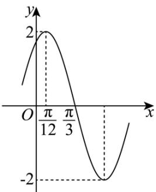

<!-- question-source:start -->
11. 已知函数 $f(x) = A \sin (\omega x + \varphi) (A > 0, \omega > 0, |\varphi| < \frac{\pi}{2})$ 部分图象如图所示，则下列说法正确的是（）

A. $\omega = 2$ B. $f(x)$ 的图象关于点 $\left(-\frac{2\pi}{3},0\right)$ 对称

C. 将函数 $y = 2\cos \left(2x + \frac{\pi}{3}\right)$ 的图象向右平移 $\frac{\pi}{2}$ 个单位得到函数 $f(x)$ 的图象
D. 若方程 $f(x)=m$ 在 $\left\lceil0,\frac{\pi}{2}\right\rceil$ 上有且只有一个实数根，则m的取值范围是 $\left\lceil-\sqrt{3},\sqrt{3}\right\rceil$
<!-- question-source:end -->

![[Q00092725A1]]
