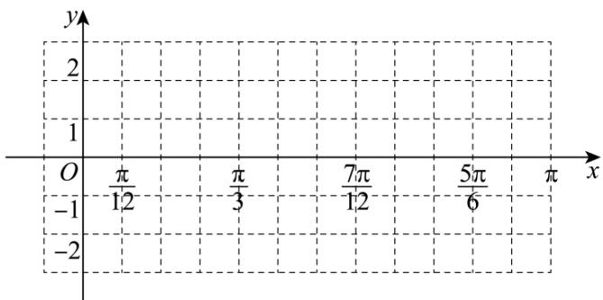

<!-- question-source:start -->
18. 函数 $f(x) = 2\sin (2x + \varphi)(0 < \varphi < \frac{\pi}{2})$ 的一个对称中心是 $(\frac{\pi}{3}, 0)$ .

(1) 求函数 $f(x)$ 的最值及 x 为何值时取到;

(2)用“五点法”画出函数 $f(x)$ 在 $[0,\pi]$ 上的简图.
<!-- question-source:end -->

![[Q00092732A1]]
