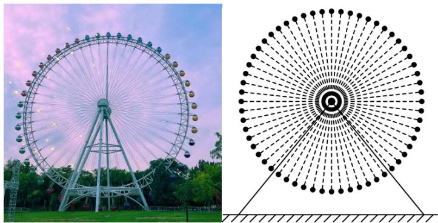
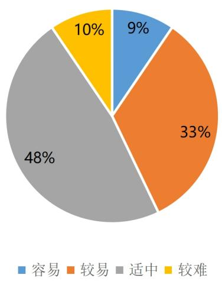

<!-- question-source:start -->
21. 位于郑州海昌海洋旅游度假区内的“郑州之眼”摩天轮是目前中原地区最高的摩天轮。该摩天轮的最高点距离地面的高度约为105米，最低点距离地面约为15米，摩天轮上均匀设置了60个座舱。开启后摩天轮按逆时针方向匀速转动，游客在座舱离地面最近时的位置进入座舱，摩天轮转完一周后在相同的位置离开座舱。摩天轮转一周大约需要30分钟，当游客甲坐上摩天轮的座舱开始计时。

(1) 经过 $t$ 分钟后游客甲距离地面的高度为 $H$ 米，求 $H(t)$ 的解析式；

(2) 游客甲坐上摩天轮后多长时间，距离地面的高度恰好为 37.5 米？

(3)若游客乙在游客甲之后进入座舱，且中间间隔9个座舱，从甲进入座舱开始计时，在摩天轮转动一周的过程中，记两人距离地面的高度差为 $h$ 米，求 $h$ 的最大值及此时的时间 $t$ .

# 内蒙古包头市第九中学 2024-2025 学年高一下学期 3 月阶段性考试数学试题

整体难度：适中

考试范围：三角函数与解三角形、函数与导数

试卷题型

<table><tr><td>题型</td><td>数量</td></tr><tr><td>单选题</td><td>9</td></tr><tr><td>多选题</td><td>3</td></tr><tr><td>填空题</td><td>4</td></tr><tr><td>解答题</td><td>5</td></tr></table>

试卷难度

<table><tr><td>难度</td><td>题数</td></tr><tr><td>容易</td><td>2</td></tr><tr><td>较易</td><td>7</td></tr><tr><td>适中</td><td>10</td></tr><tr><td>较难</td><td>2</td></tr></table>

细目表分析

<table><tr><td>题号</td><td>难度系数</td><td>详细知识点</td></tr><tr><td colspan="3">一、单选题</td></tr><tr><td>1</td><td>0.94</td><td>描述正(余)弦型函数图象的变换过程</td></tr><tr><td>2</td><td>0.85</td><td>二倍角的余弦公式;诱导公式五、六</td></tr><tr><td>3</td><td>0.94</td><td>二倍角的余弦公式;二倍角的正弦公式;二倍角的正切公式</td></tr><tr><td>4</td><td>0.85</td><td>半角公式</td></tr><tr><td>5</td><td>0.85</td><td>求cosx(型)函数的值域</td></tr><tr><td>6</td><td>0.85</td><td>函数图像的识别</td></tr><tr><td>7</td><td>0.65</td><td>逆用和、差角的余弦公式化简、求值</td></tr><tr><td>8</td><td>0.65</td><td>利用正切函数的单调性求参数;比较正切值的大小;求正切(型)函数的周期;求正切(型)函数的对称中心</td></tr><tr><td>9</td><td>0.4</td><td>根据函数零点的个数求参数范围;正弦函数图象的应用;三角恒等变换的化简问题</td></tr><tr><td colspan="3">二、多选题</td></tr><tr><td>10</td><td>0.65</td><td>用和、差角的正弦公式化简、求值;二倍角的正弦公式;用和、差角的余弦公式化简、求值</td></tr><tr><td>11</td><td>0.65</td><td>由图象确定正(余)弦型函数解析式;求图象变化前(后)的解析式;求正弦(型)函数的对称轴及对称中心;求sinx型三角函数的单调性</td></tr><tr><td>12</td><td>0.4</td><td>根据函数零点的个数求参数范围;求正弦(型)函数的最小正周期;求sinx型三角函数的单调性;求含sinx(型)的二次式的最值</td></tr><tr><td colspan="3">三、填空题</td></tr><tr><td>13</td><td>0.85</td><td>求正切(型)函数的定义域</td></tr><tr><td>14</td><td>0.65</td><td>已知弦(切)求切(弦);用和、差角的余弦公式化简、求值</td></tr><tr><td>15</td><td>0.85</td><td>由奇偶性求函数解析式;由函数的周期性求函数值;求函数值;特殊角的三角函数值</td></tr><tr><td>16</td><td>0.65</td><td>几何中的三角函数模型;三角函数在生活中的应用</td></tr><tr><td colspan="3">四、解答题</td></tr><tr><td>17</td><td>0.65</td><td>给角求值型问题;二倍角的正弦公式;二倍角的余弦公式;辅助角公式</td></tr><tr><td>18</td><td>0.85</td><td>五点法画正弦函数的图象;利用正弦函数的对称性求参数;求含sinx(型)函数的值域和最值</td></tr><tr><td>19</td><td>0.65</td><td>三角函数恒等式的证明——同角三角函数基本关系;二倍角的余弦公式;二倍角的正弦公式;二倍角的正切公式</td></tr><tr><td>20</td><td>0.65</td><td>求含sinx(型)函数的值域和最值;求图象变化前(后)的解析式;辅助角公式;求sinx型三角函数的单调性</td></tr><tr><td>21</td><td>0.65</td><td>由正(余)弦函数的性质确定图象(解析式);三角函数在生活中的应用;利用给定函数模型解决实际问题</td></tr></table>

## 知识点分析

<table><tr><td>序号</td><td>知识点</td><td>对应题号</td></tr><tr><td>1</td><td>三角函数与解三角形</td><td>1,2,3,4,5,7,8,9,10,11,12,13,14,15,16,17,18,19,20,21</td></tr><tr><td>2</td><td>函数与导数</td><td>6,9,12,15,21</td></tr></table>
<!-- question-source:end -->

![[Q00092735A1]]
