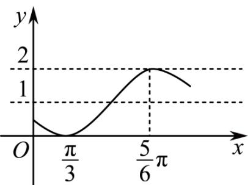

<!-- question-source:start -->
4. 函数 $y = \sin (\omega x + \varphi) + 1$ 的一段图象如图所示，则它的一个周期 T、初相 $\varphi$ 依次为（）

A. $T = 2\pi, \varphi = -\frac{7}{6}\pi$ B. $T = 2\pi, \varphi = -\frac{7}{12}\pi$

C. $T = \pi ,\varphi = -\frac{7}{6}\pi$ D. $T = \pi ,\varphi = -\frac{7}{12}\pi$
<!-- question-source:end -->

![[Q00092739A1]]
