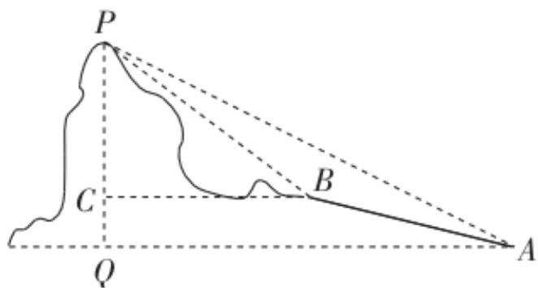

<!-- question-source:start -->
8. 如图, 在山脚 $A$ 测得山顶 $P$ 的仰角为 $37^{\circ}$ , 沿坡角为 $23^{\circ}$ 的斜坡向上走 $28 \mathrm{~m}$ 到达 $B$ 处, 在 $B$ 处测得山顶 $P$ 的仰角为 $53^{\circ}$ , 且 $A, B, P, C, Q$ 在同一平面, 则山的高度为 (参考数据: 取 $\sin 37^{\circ} = 0.6$ ) ( )

A. $30 \mathrm{~m}$ B. $32 \mathrm{~m}$ C. $34 \mathrm{~m}$ D. $36 \mathrm{~m}$
<!-- question-source:end -->

![[Q00092743A1]]
