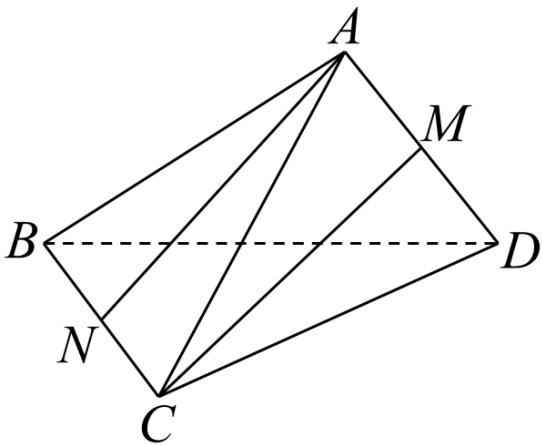

<!-- question-source:start -->
9. 如图，在三棱锥 $A - BCD$ 中， $AB = AC = BD = CD = \sqrt{3}$ ， $AD = BC = 2$ ， $M, N$ 分别是 $AD, BC$ 的中点。则异面直线 $AN, CM$ 所成的角为（）

A. $30^{\circ}$ B. $45^{\circ}$ C. $60^{\circ}$ D. $90^{\circ}$
<!-- question-source:end -->

![[Q00092744A1]]
