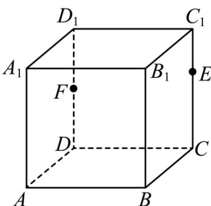

<!-- question-source:start -->
12. 如图, 正方体 $ABCD - A_1B_1C_1D_1$ 的棱长为 4, $F$ 是侧面 $ADD_1A_1$ 上的一个动点 (含边界), 点 $E$ 在棱 $CC_1$ 上, 且 $|C_1E| = 1$ , 则下列结论正确的有 ( )

A. 平面 $AD_{1}E$ 被正方体 $ABCD - A_{1}B_{1}C_{1}D_{1}$ 截得截面为等腰梯形  
B. 若 $\overrightarrow{DF} = FD_{1}$ ，直线 $AF \perp D_{1}E$ C. 若 $F$ 在 $DD_{1}$ 上， $BF + FE$ 的最小值为 $\sqrt{57 + 32\sqrt{2}}$ D. 若 $DF \perp BD_{1}$ ，点 $F$ 的轨迹长度为 $4\sqrt{2}$
<!-- question-source:end -->

![[Q00092747A1]]
