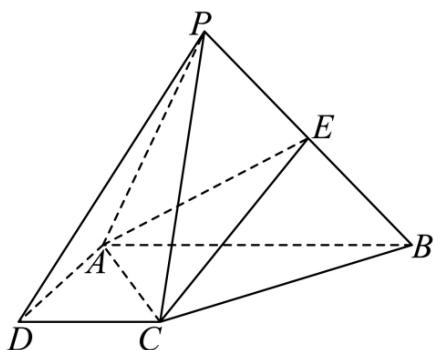

<!-- question-source:start -->
19. 如图, 在四棱锥 $P - ABCD$ 中, $PC \perp$ 底面 $ABCD$ , $ABCD$ 是直角梯形, $AD \perp DC$ , $AB // DC$ , $AB = 2AD = 2CD = 2$ , 点 $E$ 是 $PB$ 的中点.

(1)线段PA上是否存在一点G，使得点D，C，E，G共面？若存在，请证明，若不存在，请说明理由；

(2) 若 $PC = 2$ ，求三棱锥 $P - ACE$ 的体积.
<!-- question-source:end -->

![[Q00092754A1]]
