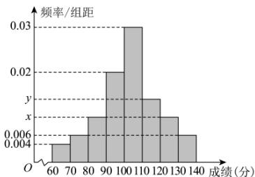

<!-- question-source:start -->
20. 某中学为了解该校高三年级学生数学学习情况, 对一模考试数学成绩进行分析, 从中抽取了 50 名学生的成绩作为样本进行统计 (若该校全体学生的成绩均在[60, 140)分), 按照[60, 70), [70, 80), [80, 90), [90, 100), [100, 110), [110, 120),[120, 130), [130, 140) 的分组做出频率分布直方图如图所示，若用分层抽样从分数在[70, 90) 内抽取8人，则抽得分数在[70, 80) 的人数为3人.

(1) 求频率分布直方图中的 x, y 的值；并估计本次考试成绩的平均数（以每一组的中间值为估算值）；

(2) 计算该校高三年级学生一模考试数学成绩的第 95 百分位数. (结果保留一位小数)
<!-- question-source:end -->

![[Q00092755A1]]
