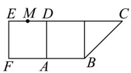
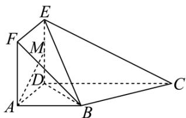

<!-- question-source:start -->
21. 如图 1, 在直角梯形 $ABCD$ 中, $AB // CD$ , $AB \perp AD$ , 且 $AB = AD = \frac{1}{2} CD = 1$ , 现以 $AD$ 为一边向梯形外作正方形 $ADEF$ , 然后沿边 $AD$ 将正方形 $ADEF$ 翻折, 使 $ED \perp DC$ , $M$ 为 $ED$ 的中点, 如图 2.

  
图1

  
图2

(1) 求证: 平面 $BCD \perp$ 平面BDE;

(2) 求 BE 与平面 ADEF 所成角的正弦值.
<!-- question-source:end -->

![[Q00092756A1]]
