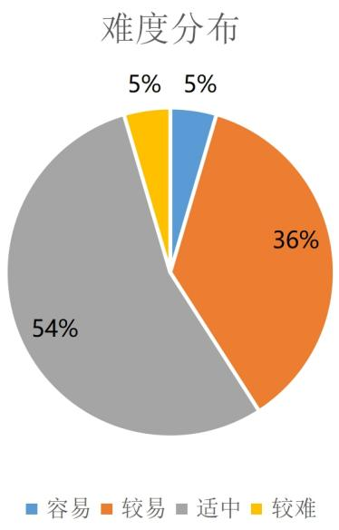

<!-- question-source:start -->
22. 已知函数 $f(x) = 2\sqrt{3}\sin \omega x\cos \omega x - 2\sin^2\omega x + 1, \omega \neq 0$

(1) 若 $f(x_1) \leq f(x) \leq f(x_2)$ ， $|x_1 - x_2|_{\min} = \frac{\pi}{2}$ ，求函数 $f(x)$ 的解析式及对称轴；

(2) 已知 $0 < \omega < 5$ ，函数 $f(x)$ 的图象向右平移 $\frac{\pi}{6}$ 个单位，再向上平移 1 个单位，得到函数 $g(x)$ 的图象， $x = \frac{\pi}{3}$ 是 $g(x)$ 一个零点，当 $x \in \lceil \frac{\pi}{9}, \frac{17\pi}{36} \rceil$ 时，方程 $g(x) - a = 0$ 恰有三个不相等的实数根 $x_{1}$ 、 $x_{2}$ 、 $x_{3}$ $(x_{1} < x_{2} < x_{3})$ ，求实数 a 的取值范围以及 $x_{1} + 2x_{2} + x_{3}$ 的值.

内蒙古包头市第九中学 2024-2025 学年高一下学期 6 月阶段性考试数学试卷

整体难度：适中

考试范围：复数、空间向量与立体几何、计数原理与概率统计、三角函数与解三角形、平面向量、平面解析几何、函数与导数

试卷题型

<table><tr><td>题型</td><td>数量</td></tr><tr><td>单选题</td><td>9</td></tr><tr><td>多选题</td><td>3</td></tr><tr><td>填空题</td><td>4</td></tr><tr><td>解答题</td><td>6</td></tr></table>

试卷难度

<table><tr><td>难度</td><td>题数</td></tr><tr><td>容易</td><td>1</td></tr><tr><td>较易</td><td>8</td></tr><tr><td>适中</td><td>12</td></tr><tr><td>较难</td><td>1</td></tr></table>

细目表分析

<table><tr><td>题号</td><td>难度系数</td><td>详细知识点</td></tr><tr><td colspan="3">一、单选题</td></tr><tr><td>1</td><td>0.85</td><td>虚数单位i及其性质;复数的除法运算</td></tr><tr><td>2</td><td>0.85</td><td>判断面面平行;面面垂直证线面垂直;判断线面平行;空间垂直的转化</td></tr><tr><td>3</td><td>0.85</td><td>计算几个数据的极差、方差、标准差;计算几个数的中位数;计算几个数的平均数</td></tr><tr><td>4</td><td>0.65</td><td>由图象确定正(余)弦型函数解析式</td></tr><tr><td>5</td><td>0.85</td><td>圆台表面积的有关计算;台体体积的有关计算</td></tr><tr><td>6</td><td>0.65</td><td>向量的线性运算的几何应用;平面向量基本定理的应用;向量减法的法则</td></tr><tr><td>7</td><td>0.65</td><td>空间向量数量积的应用</td></tr><tr><td>8</td><td>0.65</td><td>高度测量问题;正弦定理解三角形</td></tr><tr><td>9</td><td>0.65</td><td>求异面直线所成的角</td></tr><tr><td colspan="3">二、多选题</td></tr><tr><td>10</td><td>0.65</td><td>向量夹角的坐标表示;已知向量共线(平行)求参数;平面向量数量积的几何意义;利用向量垂直求参数</td></tr><tr><td>11</td><td>0.85</td><td>根据条形统计图解决实际问题;根据扇形统计图解决实际问题</td></tr><tr><td>12</td><td>0.65</td><td>判断正方体的截面形状;证明线面垂直;线面垂直证明线线垂直;立体几何中的轨迹问题</td></tr><tr><td colspan="3">三、填空题</td></tr><tr><td>13</td><td>0.94</td><td>计算古典概型问题的概率</td></tr><tr><td>14</td><td>0.85</td><td>三角函数的化简、求值——诱导公式;二倍角的余弦公式</td></tr><tr><td>15</td><td>0.65</td><td>已知数量积求模;向量夹角的计算;用定义求向量的数量积;数量积的运算律</td></tr><tr><td>16</td><td>0.65</td><td>球的表面积的有关计算;多面体与球体内切外接问题;正弦定理求外接圆半径;线面垂直证明线线垂直</td></tr><tr><td colspan="3">四、解答题</td></tr><tr><td>17</td><td>0.65</td><td>用基底表示向量;用定义求向量的数量积;向量的模;向量夹角的计算</td></tr><tr><td>18</td><td>0.65</td><td>正弦定理边角互化的应用;余弦定理解三角形;用和、差角的正弦公式化简、求值;已知数量积求模</td></tr><tr><td>19</td><td>0.65</td><td>锥体体积的有关计算;空间中的点(线)共面问题</td></tr><tr><td>20</td><td>0.85</td><td>由频率分布直方图估计平均数;总体百分位数的估计;抽样比、样本总量、各层总数、总体容量的计算;由频率分布直方图计算频率、频数、样本容量、总体容量</td></tr><tr><td>21</td><td>0.85</td><td>求线面角;证明面面垂直;证明线面垂直</td></tr><tr><td>22</td><td>0.4</td><td>根据函数零点的个数求参数范围;求正弦(型)函数的对称轴及对称中心;求图象变化前(后)的解析式;三角恒等变换的化简问题</td></tr></table>

## 知识点分析

<table><tr><td>序号</td><td>知识点</td><td>对应题号</td></tr><tr><td>1</td><td>复数</td><td>1</td></tr><tr><td>2</td><td>空间向量与立体几何</td><td>2,5,7,9,12,16,19,21</td></tr><tr><td>3</td><td>计数原理与概率统计</td><td>3,11,13,20</td></tr><tr><td>4</td><td>三角函数与解三角形</td><td>4,8,14,16,18,22</td></tr><tr><td>5</td><td>平面向量</td><td>6,10,15,17,18</td></tr><tr><td>6</td><td>平面解析几何</td><td>12</td></tr><tr><td>7</td><td>函数与导数</td><td>22</td></tr></table>
<!-- question-source:end -->

![[Q00092757A1]]
